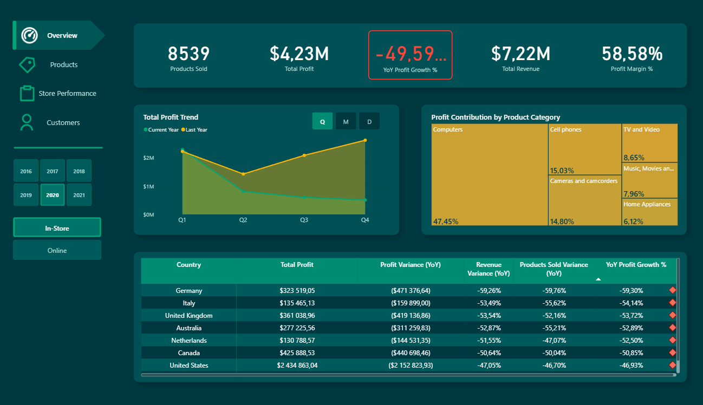
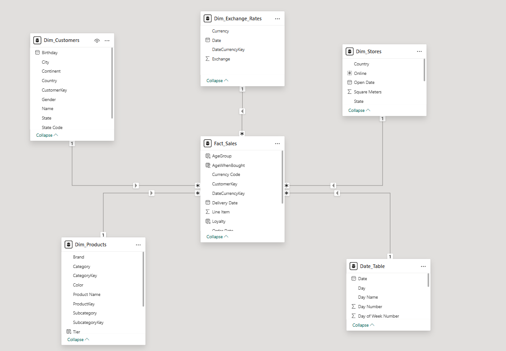

# Global Electronics Retailer - Sales Performance Dashboard

### Strategic Analysis for Commercial Director

## Project Overview
This project is a comprehensive Power BI dashboard designed for a **Commercial Director**

The main goal of the report is to analyze the root causes of a significant profit decline in the recent year.

## Dashboard Gallery

### 1. Overview

### 2. Data Model 

### 3. Mobile Layout

###  Data Source
The dataset used for this project is the **Global Electronics Retailer** dataset.

---

##  How to Run & Change Data Source (Important!)
**Note:** Power BI stores absolute file paths. To refresh data or work with the Power Query editor locally, you must update the data source connection to match your local folder structure.

###  Steps to set up:
1.  **Download** the repository as a ZIP file (or clone it).
2.  **Unzip** the folder. You will see the `.pbix` file and a `Data` folder containing CSV files.
3.  **Open** the `.pbix` file in Power BI Desktop.
    * *Note: You will see the visual data immediately because it is imported into the file. However, clicking "Refresh" will cause an error until you complete the next steps.*
4.  Go to the **Home** ribbon -> **Transform Data** -> **Data Source Settings**.
5.  Select the existing file path shown in the list.
6.  Click **Change Source...**
7.  Click **Browse** and navigate to the `Data` folder where you unzipped the project on your computer.
8.  Repeat this for all CSV files if they are listed separately (Sales, Products, Customers, etc.).
9.  Click **Close** and then **Refresh** on the main ribbon.